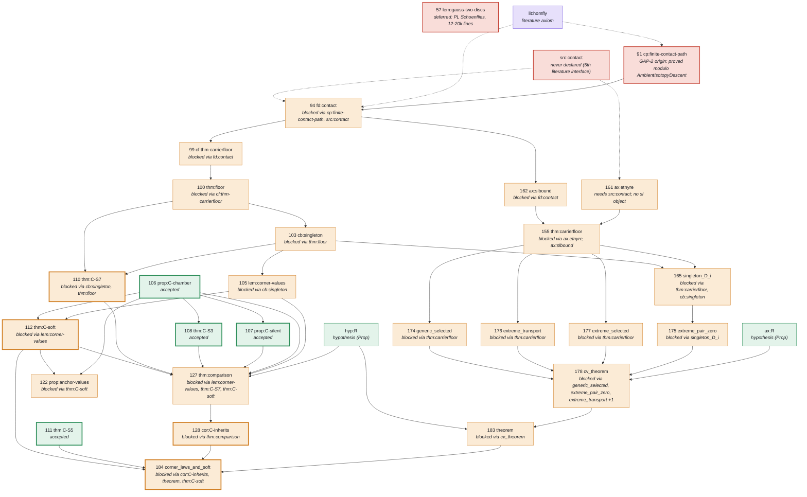

# corner-laws-lean

Machine-checked (Lean 4) formalization of **"Corner state sum: wall laws and soft theorem"** (source frame SM15,
frozen 2026-09-12). The single deliverable is one Lean theorem, `SM.corner_laws_and_soft`: the corner state sum `C`
satisfies every wall law of `cor:A-lawful` on the printed domains, together with the soft theorem, with Hypothesis R
*proved* rather than assumed.

The work is executed autonomously by a Claude Code session on Mark's pod, one source statement at a time, with
independent AI reviewers checking that each Lean statement says what the paper says. This repository is the single
source of truth for the package; it replaces the tarballs that were passed back and forth until 2026-09-14.

| State as of 2026-09-14 18:20 UTC | |
|---|---|
| Source claims proved and accepted | **109 / 132** (82.6 %) |
| Checklist rows accepted (definitions, claims, interfaces, obligations) | **168 / 192** |
| Final targets accepted | **4 / 8** — chamber constancy, silence, flat law, empty-cusp zero |
| Pending rows | **24** — 22 behind GAP-2, 1 deferred, 1 undeclared interface |
| Placeholders (`sorry`, `admit`, `native_decide`) in `work/lean` | **0** (667 files, 247,952 lines) |
| Axioms beyond Lean's three standard ones | **4**, all registered literature inputs of the paper |
| Stage check `tools/check_lean.py work/lean --all` | **INCOMPLETE** (the 24 rows above) |
| Reviews | 168 / 168 rows have an independent review record; all reviewers are AI sessions, no human has read them yet |

Everything above was re-verified on 2026-09-14 by the static audit in [`tools_extra/static_audit.py`](tools_extra/static_audit.py)
(output below). A full Lean rebuild has not been repeated outside Mark's pod; the shipped sources are byte-identical
to the files named in the pod's final checker receipt.

---

## 1. The goal, in eight parts

`TARGETS.md` in the package fixes the final theorem as the conjunction of eight source results, each with a
checker-enforced Lean name (`work/lean/axiom-policy.json`).

| # | Source result | Lean name | Status |
|---|---|---|---|
| 106 | prop:C-chamber — `C` is constant on every chamber | `SM.prop_C_chamber` | accepted |
| 107 | prop:C-silent — silent walls (exterior extension, pure cut) | `SM.prop_C_silent` | accepted |
| 108 | thm:C-S3 — the flat law | `SM.thm_C_S3` | accepted |
| 111 | thm:C-S5 — the empty-cusp zero | `SM.thm_C_S5` | accepted |
| 110 | thm:C-S7 — the vertex–edge law (bigon and sliding) | `SM.thm_C_S7` | pending, GAP-2 |
| 112 | thm:C-soft — the soft theorem for `C` | `SM.thm_C_soft` | pending, GAP-2 |
| 128 | cor:C-inherits — every law of cor:A-lawful, incl. the full cusp law | `SM.cor_C_inherits` | pending, GAP-2 |
| 184 | SM:corner_laws_and_soft — the assembly, with R discharged | `SM.corner_laws_and_soft` | pending, GAP-2 |

Hypothesis R is stated (`SM.hyp_R`, accepted as a definition) and its proof route is in place: four of the nine R
obligations plus the four bridge lemmas B1–B4 are accepted; the remaining R obligations wait on the same gap.

---

## 2. What blocks the rest: GAP-2

Row 91 `cp:finite-contact-path` needs "an ambient isotopy of links gives equal HOMFLY values of their diagrams". The
paper's literature input lit:homfly ends with exactly that sentence ("Its value depends only on the oriented link
presented by D"). The executor's design decision D2 encoded the sentence more weakly, as invariance under planar isotopy
and the three Reidemeister moves between *polygonal diagrams*, and declared Reidemeister's theorem out of scope. So the
accepted axiom `SM.lit_homfly` is weaker than the printed one. Row 91 is proved modulo one proposition,
`SM.AmbientIsotopyDescent` (`work/lean/SM/ContactPathOfDescent.lean`), and 22 rows behind it stay open: the four
remaining targets, the CV carrier-floor branch, the R obligations, the bridge theorem and the final theorem.

**Decision (2026-09-15):** restate, in the additive form — declare the printed descent sentence as its own axiom about
the existing `SM.homfly`, register it under lit:homfly, review it, close row 91, continue. No accepted declaration
changes and the 28 rows that use the axiom keep their reviewed statements. Details and the note sent to Mark:
[`docs/DECISION_GAP2_2026-09-15.md`](docs/DECISION_GAP2_2026-09-15.md).

Two small leftovers are independent of GAP-2: row 57 `lem:gauss-two-discs` (a polygonal Jordan–Schoenflies fact,
judged 12–20k lines and deferred; its only accepted consumer was proved without it) and the fifth literature interface
`src:contact`, never declared because nothing could consume it yet.

### The critical path

Read top to bottom; an arrow means "is needed by". Green = accepted, orange = pending behind something else,
red = pending with every prerequisite accepted (the only places work can start), violet = literature axiom,
thick border = one of the eight targets. Dashed arrows are the two inputs that explain the gap.



The same figure with swim-lane columns, as a static image: [`docs/proof-graph-critical.svg`](docs/proof-graph-critical.svg).

---

## 3. The whole graph

All 192 checklist rows in eleven swim lanes by chapter of the source, prerequisites on the left, wired by the 443
blueprint dependency edges. Click the image and use the browser's zoom; every node carries its row id.


An interactive version with pan/zoom, lane filters, a "what blocks the final theorem" mode and a per-row panel
(source line, Lean name, prerequisites, consumers, root causes) is [`docs/corner_laws_proof_graph.html`](docs/corner_laws_proof_graph.html);
download it and open it in a browser (GitHub does not render HTML). All three are generated from the package by
[`docs/graph/build_dag.py`](docs/graph/build_dag.py) and [`docs/graph/render_svg.py`](docs/graph/render_svg.py):

```sh
cd docs/graph && python3 build_dag.py dag_data.json && python3 render_svg.py dag_data.json ..
python3 - <<'EOF'
d=open('dag_data.json').read().replace('</','<\\/'); h=open('dag.tmpl.html').read().replace('/*__DATA__*/null',d)
open('../corner_laws_proof_graph.html','w').write(h)
EOF
```

Rerun them after the declaration map changes, and paste the new `docs/critical.mmd` into section 2.

---

## 4. Repository layout

```
CORNER_LAWS_FOCUSED_20260912/   the package from Mark's 2026-09-14 handover (three deliberate changes, listed below)
  START_HERE.md, CLAUDE.md …    the executor's instructions; CLAUDE.md's rules override everything else in the package
  TARGETS.md, PROOF_PLAN.md     the eight targets with the printed statements; the proof route
  FINAL_REVIEW.md               the completed fidelity review (per-row status, disclosed readings, remaining gaps)
  blueprint/                    frozen: the 172 selected source statements, AXIOM_REGISTRY.md, DEPENDENCIES.json, NODES.tsv
  reference/, provenance/       frozen: the source TeX extracts (frame SM15) and the pins that tie them to the manuscript
  SOURCES/                      the literature behind the five admitted interfaces (third-party PDFs: keep this repo private)
  tools/                        claims.py (worklist), progress.py (the 15-minute line), check_lean.py (build + kernel axiom audit)
  work/lean/                    the Lean library: 628 SM, 28 CV, 5 RProof, 4 Bridge modules + Supplemental/Audit.lean
  work/lean/lean-declarations.json   the declaration map: one entry per row with status, Lean name, module, review, hash
  work/lean/axiom-policy.json   the registered axioms and the fixed names of the targets
  work/reviews/                 one JSON review record per accepted row (+ reviewer inputs and source excerpts)
  work/drafts/                  provenance of every ported module: plans, frozen statements, prover units, reports
  work/checks/                  checker receipts (dev-check-*.json, stage-*.json) and the previous executor's candidate lane
  work/AUTHOR_NOTES.md          the decision log (~5,100 lines, every design decision with its id: D-*, FR-*, …)
  work/STATUS.md                dated checkpoints; work/RESUME_FOR_NEXT_AGENT.md: how to pick the work up
  work/delivery/                the packaged delivery (README, pins, receipts, refresh.sh)
handover/                       the 2026-09-14 handover note and the executing session's memory files
docs/                           this README's figures, the interactive graph, the GAP-2 decision record
tools_extra/static_audit.py     the one-minute audit (no Lean needed)
RESEARCH_LOG.md                 the owner-side log of audits and decisions
```

Ignored (see `.gitignore`): the Lean build cache `work/lean/.lake` (gigabytes, rebuilt by `lake build`), the two
0.85 GB files the checker rewrites on every run (`declaration-audit.json`, `lean-check.log`), the compressed audit copy
in `work/delivery/receipts`, session logs, and handover archives.

Deliberate changes to the package in this repository, relative to the handover tarball:

1. The package shipped its own `.gitignore` with `work/` on the first line, which would have kept the entire Lean
   library, the reviews and the drafts out of git. That line is removed; the other three lines stay.
2. The root `MANIFEST.sha256` is refreshed for `.gitignore` and for `FINAL_REVIEW.md` (stale since the executor
   completed the review on 09-14 without refreshing the manifest), so `verify_bundle.py` passes again.
3. The stray 7-byte file `=3` at the package root (a shell artefact) is deleted.

Nothing under `work/`, `blueprint/`, `reference/`, `provenance/` or `SOURCES/` changed; every file named in the pod's
final checker receipt still matches its hash.

---

## 5. Building and checking

Pins: Lean `leanprover/lean4:v4.34.0-rc2`, Mathlib `85e3a25e006c35636f0e53b0e9296caca2685bc0` (`work/lean/lake-manifest.json`).
Machine: 8 cores and 16 GB RAM minimum, 32 GB recommended, ~10 GB disk for the caches.

```sh
cd CORNER_LAWS_FOCUSED_20260912
bash setup.sh                 # installs elan + toolchain, clones deps, downloads prebuilt Mathlib, builds, verifies
```

In the handover tarball, `setup.sh` stops at its verification step because the root manifest was stale (section 4);
this repository carries the refreshed manifest, so `setup.sh` runs through. The same steps, run separately:

```sh
cd CORNER_LAWS_FOCUSED_20260912/work/lean && lake build            # 20–40 min on 8 cores with the Mathlib cache
cd ../.. && python3 tools/check_lean.py work/lean                    # expected: passed true, mapped 168, audited 36079
python3 tools/check_lean.py work/lean --all                          # expected: FAIL, "stage is incomplete", 24 rows
```

`check_lean.py` builds the mapped modules, then runs `Supplemental.auditProject` inside Lean: every declaration of the
project is checked against the registered axiom list (`sorryAx`, `native_decide` and unregistered axioms are rejected)
and every mapped row's statement is hashed together with its semantic dependencies. Its receipt is
`work/checks/stage-development.json`.

The static audit needs only Python and takes about a minute:

```sh
python3 tools_extra/static_audit.py CORNER_LAWS_FOCUSED_20260912
```

Output on 2026-09-15 for this repository's copy:

```
lean files: 667 | lines: 247952
code-level sorry/admit/native_decide: 0
axiom declarations: ng_finite_word (work/lean/SM/FrontInterfaces.lean), lit_homfly (work/lean/SM/LinkInterfaces.lean),
                    lp_lm (work/lean/SM/LinkInterfaces.lean), lp_lm_uniqueness (work/lean/SM/LinkInterfaces.lean)
final receipt: passed=True mapped=168 audited=36079 | files hashed 671, mismatching 0, unhashed .lean 0
declaration map: {'accepted': 168, 'pending': 24}
accepted statement hashes vs shipped audit: 168/168 match
fixed-name declarations absent: 12: Bridge:theorem, R:cv_theorem, R:extreme_pair_zero, R:extreme_selected,
    R:extreme_transport, R:generic_selected, SM:corner_laws_and_soft, cor:C-inherits, thm:C-S7, thm:C-soft, thm:comparison, src:contact
verify_bundle.py: PASS
RESULT: PASS (0 warnings)
```

---

## 6. How the work is done

- **One row at a time.** `python3 tools/claims.py --next` names the next unit in document order. For each row the
  executor fixes the Lean statement first (one field per printed clause, with a docstring mapping the paper's notation),
  proves it (for large rows: a design panel, then parallel prover units on a frozen skeleton), ports the finished draft
  verbatim into `work/lean`, maps the row, and runs the checker.
- **Independent review before acceptance.** Reviewers see only the printed source, the Lean statement with every proof
  replaced by `sorry`, and the definition modules; three lenses (literal, definitions, strength) plus two adversarial
  refuters; acceptance needs three "faithful" verdicts and no refutation. The record, with the hashes of everything the
  reviewers read, is `work/reviews/<row>.json`. Fidelity risks are written to `AUTHOR_NOTES.md` *before* a row is
  stated. All reviewers so far are Claude sessions of the same model family as the implementer; this is disclosed in
  every record.
- **Rules that never bend** (package `CLAUDE.md`): no `sorry` in `work/lean`; never delete, rename or rewrite an
  accepted declaration; the frozen folders are never edited; a statement believed false gets a kernel-checked
  counterexample under `work/repairs/` and stays unaccepted; an incomplete stage is reported as incomplete.
- **Reassessment rule** (`handover/handover_extras/reassessment_rule.md`): after two substantive attempts or 60 minutes
  without a newly accepted claim, the executor stops expanding and writes a bounded audit into `AUTHOR_NOTES.md`.
- **Reporting.** `python3 tools/progress.py --once` prints the one-line status ("claims verified X/132"); checkpoints go
  to `work/STATUS.md`; from now on a checkpoint is a commit, a handover is a tag.

---

## 7. Known defects and caveats (2026-09-14 audit)

1. In the handover tarball the root `MANIFEST.sha256` was stale for `FINAL_REVIEW.md`, so `verify_bundle.py` exited 1
   and `setup.sh` stopped before the checker. Fixed in this repository (section 4); Mark's copy has it until the next pull.
2. Three unmapped conditional modules are outside the checker's build and kernel audit and are covered by `lake build`
   only: `SM/ContactPathOfDescent.lean` (row 91 modulo the descent clause), `Bridge/SmR.lean`
   (`CV.hyp_R → SM.hyp_R`), `SM/CeRoundingNonVacuity.lean`. The static audit confirms they contain no placeholder or axiom.
3. Two accepted rows have a blueprint prerequisite that is still pending: `cb:embedded-rotation` was proved without
   `lem:gauss-two-discs` (decision D-ER1), and `thm:uniqueness` is accepted although `prop:anchor-values` is pending.
   Kernel-checked proofs cannot cite a pending row, so these are blueprint edges the proof route did not use.
4. All reviews are AI reviews; no human has read any of the 168 records. `STATE_OF_WORK.md` §4 asked for a human
   countersignature before stage acceptance.
5. Cosmetic: 57 module headers still say "sorry-free" in prose (the checker rejects the token only in code); several
   docstring citation nits are listed in `FINAL_REVIEW.md` §5 and `work/STATUS.md` item 6. Accepted declarations are
   never touched, so these wait for a layer rebuild.
6. `RESUME_FOR_NEXT_AGENT.md` and `AUTHOR_NOTES.md` were written by the executor and fact-checked by a second agent; the
   wall-clock claims in them (checker 4–6 min, lanes 1–3 h) were not verified.

---

## 8. History

| Date | Event |
|---|---|
| 2026-09-09 | First handoff package (frame SM12): scaffold and sources, no proofs. |
| 2026-09-10 | Focused package "corner laws" cut from the full handoff; infrastructure audit (`DELIVERY_AUDIT.md`, `VALIDATION.md`). |
| 2026-09-12 | Previous executor found `lem:shift`(iii) false off the generic locus (`ERRATUM_20260912.md`); source re-issued as frame SM15; package realigned (`SM15_REALIGNMENT.md`). State: 20/132 claims, 40/192 rows. |
| 2026-09-13 13:40 UTC | Mark's pod executor starts from that state. |
| 2026-09-14 18:20 UTC | Reachable ceiling without a GAP-2 decision: 109/132 claims, 168/192 rows, 4/8 targets. `FINAL_REVIEW.md` completed. |
| 2026-09-14 21:15 UTC | Handover tarball `lean_handover_mark.tgz` built on the pod; audited on the owner's side (`RESEARCH_LOG.md`). |
| 2026-09-15 | GAP-2 decision: restate the descent clause additively (`docs/DECISION_GAP2_2026-09-15.md`). This repository created from the handover. |

The earlier packages are not in this history; they live in the owner's cloud storage and can be imported as initial
commits if diffs between frames are ever needed.

---

## 9. Next steps

1. Mark's executor applies the GAP-2 decision: declares `SM.lit_homfly_descent`, registers it, gets it reviewed,
   closes row 91, and works down the 22 dependent rows; declares `src:contact`; refreshes the manifest line.
2. Each accepted row becomes a commit on `main`; each checkpoint tarball becomes a tag.
3. Add the static audit as a GitHub Action so every push is checked within a minute; keep the full Lean build on the
   pod and commit its receipt with the code.
4. Regenerate the figures in `docs/` when the declaration map changes (section 3).
