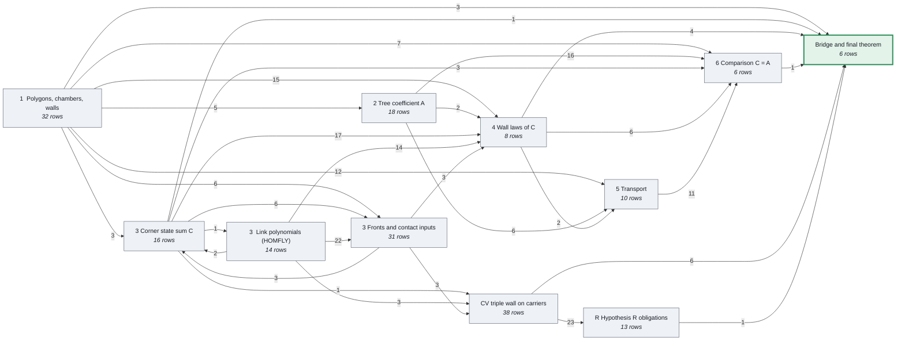
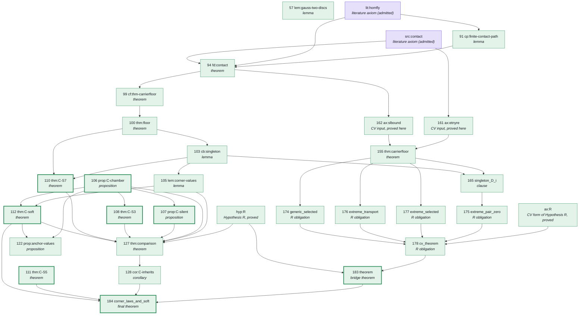
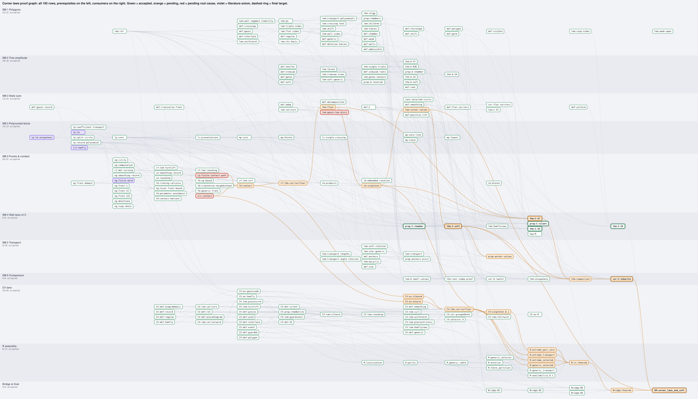

# Corner state sum: wall laws and soft theorem. Lean 4 formalization

A machine-checked proof, in Lean 4, of the main theorem of the supplemental material of *Gluons and Knots*
(source frame SM15). The final statement is the Lean theorem `SM.corner_laws_and_soft`. Every statement on the
paper's proof route, 192 of them, is formalized and checked by Lean's kernel. Five results quoted from the
literature are admitted as axioms; nothing else is assumed. The build contains no `sorry`.

The theorem is about two functions on polygons in the plane. They are defined in unrelated ways and turn out to
be the same function.

- **A, the tree coefficient.** A sum over rooted plane trees, each tree weighted by signs read off the
  polygon. This is the tree-level coefficient of the main text.
- **C, the corner state sum.** A sum over ways of cutting the polygon at its self-crossings. Each piece is a
  knot diagram, and contributes one coefficient of its HOMFLY-PT polynomial.

Both are integers. Both are locally constant: they only change when the polygon passes through a degenerate
position, a *wall*, and the change at each kind of wall is given by an explicit formula, a *wall law*. The paper
proves the wall laws for A, and for C all but one: invariance across *triple* walls, which it states as
Hypothesis R. Under Hypothesis R the laws determine the function, so C = A. This formalization proves the wall
laws of C, the soft theorem, and Hypothesis R itself, so the conclusion holds with no hypothesis.

---

## The blueprint

The standard reading interface for a formalization is its *blueprint*: every printed statement of the paper's proof
route, in LaTeX, with the name of the Lean declaration that formalizes it and links to what it depends on, plus the
dependency graph. This project's blueprint is generated from the package's own data (the 192 rows of the declaration
map, the frozen statement extracts of frame SM15, the 443 blueprint edges) by `blueprint/gen_content.py`, and built
with [leanblueprint](https://github.com/PatrickMassot/leanblueprint) into `blueprint/web/`:

- **[`blueprint/web/index.html`](blueprint/web/index.html)**: eleven chapters, one per chapter of the paper plus three
  for the proof of Hypothesis R; each statement carries its Lean name and a collapsed printed proof.
- **[`blueprint/web/dep_graph_document.html`](blueprint/web/dep_graph_document.html)**: the interactive dependency
  graph of all 192 statements. Click a node for its statement, its Lean declaration and its neighbours.

GitHub does not serve HTML from a private repository, so clone the repository and open the two files in a browser, or
download the `blueprint-web` artifact of the latest CI run. Every `\lean{}` name in the blueprint is checked against the
declaration map by `ci/check_blueprint_names.py`, so a name in the blueprint is a name whose statement hash the
checker's receipts bind.

---

## 1. The objects

**Polygons.** A polygon is a list of `n ≥ 3` points `μ₁, …, μₙ` in the plane, read cyclically. Its edges are
the segments `E_i` from `μ_i` to `μ_{i+1}`. Edges are allowed to cross. (Lean: `LabelledTuple n`; the cyclic
quotient is `Polygon n`.)

**Generic polygons, chambers, walls.** A polygon is *generic* if no three vertices are collinear and no point
lies in the interior of three edges at once. Generic polygons form an open set `𝒰ₙ ⊂ (ℝ²)ⁿ`; its connected
components are the *chambers*. Moving a polygon continuously out of one chamber into another passes through a
non-generic position. Along a generic path, only the following degenerations occur. Each is a wall type.

| Wall | What happens | Law |
|---|---|---|
| flat at `j` | vertex `μ_j` crosses the segment between its two neighbours | flat law |
| cusp at `j` | vertex `μ_j` crosses the line through its neighbours, outside that segment; a small loop is created or destroyed | cusp law; empty-cusp zero |
| vertex–edge at `(M; a)` | vertex `μ_M` crosses a non-adjacent edge `E_a`; bigon type or sliding type | vertex–edge law |
| triple at `{e, f, g}` | three edges pass through one point (a Reidemeister III move of the knot diagram) | triple law: no change |
| exterior extension, pure cut | a vertex meets the line of a non-adjacent edge outside it; a cut with no crossing change | silence: no change |

**Soft insertion.** Not a wall but an operation: next to a vertex `j`, insert a new vertex at distance `ε` in
an *admissible* direction `q`. The result `P_ε` has `n + 1` vertices. The soft theorem describes `C(P_ε)` for
small `ε`.

**The tree coefficient A.** Fix a root edge; the other `n − 1` edges are the leaves, in traversal order.
`A_g(P)` is a sum over rooted plane trees whose leaves are the leaf edges. Each tree is weighted by a product of
*gate signs*, and each gate sign is a value `χ(a, b, c) ∈ {±1}` of the *chirotope*, the orientation of a triple
of vertices. The value does not depend on the root, so `A(P)` is well defined. (Lean: `SM.treeCoefficient`
rooted, `SM.amplitude` root-free; paper: def:treesum, thm:root-indep.)

**The corner state sum C.** Where two edges cross, let the edge for which the crossing is positive pass over the
other. This turns the polygon into an oriented knot diagram, its *positive lift*. Choose a set `S` of crossings
no two of which interlace, a *decomposition*, and smooth every crossing in `S`: the polygon falls apart into
closed pieces, the *carriers*. For a carrier `Q` let `H⁺_Q` be the HOMFLY-PT polynomial of its positive lift and
let `c(Q)` be the coefficient of `a^{d_Q} z⁰` in it, where `d_Q = 1 − m_Q − |r_Q|`, `m_Q` the number of crossings
of `Q` and `r_Q` its rotation number. Then

$$
C(P) \;=\; (-1)^{\ell(P)} \sum_{S \text{ uniform}} (-1)^{|S|} \prod_{Q \text{ carrier of } S} c(Q),
$$

where `ℓ(P)` is the number of left turns of `P`, and a decomposition is *uniform* when every carrier turns the
same way at all its corners. (Lean: `SM.cornerStateSum`; paper: def:C.)

---

## 2. The theorem

For every generic polygon, on the printed domains:

| Clause | Identity | Lean field | Proved as |
|---|---|---|---|
| Chamber constancy | `C` is constant on every chamber | `chamber` | prop:C-chamber |
| Silence | `C(P₊) = C(P₋)` at an exterior-extension wall or a pure cut | `silent` | prop:C-silent |
| Flat law | `C(P_right) − C(P_left) = C(P(0) \ j)` at a flat wall at `j`, `n ≥ 4` | `flat` | thm:C-S3 |
| Vertex–edge law | `C(P₊) − C(P₋) = s · C(λ₁) · C(λ₂)` at a vertex–edge wall at `(M; a)`, `λ₁, λ₂` the two halves into which the contact splits the polygon, `s` the contact sign | `vertex_edge` | thm:C-S7 |
| Triple law | `C(P₊) = C(P₋)` at every triple wall: Hypothesis R, proved | `triple` | Bridge:theorem |
| Cusp law | `C(P_loop) − C(P_no) = −κ · C(P(0) \ j)` at a cusp whose deletion is generic, threaded cusps included | `cusp` | cor:C-inherits |
| Empty-cusp zero | `C(P_no) = 0` at an empty cusp | `empty_cusp` | thm:C-S5 |
| Soft theorem | `C(P_ε) = (χ₋ + χ₊)/2 · C(P)` for all sufficiently small `ε > 0`, `χ±` the attachment signs of the insertion | `soft` | thm:C-soft |
| Normalizations | reversal `C(P̄) = (−1)ⁿ C(P)`, cyclic invariance, and the triangle values `C(K₁) = −1`, `C(K₋₁) = +1` | `reversal`, `cyclic`, `triangles` | cor:C-inherits, def:C |

Here `P(0) \ j` is the polygon at the wall with vertex `j` deleted, `P₊`/`P₋` and `P_right`/`P_left`,
`P_loop`/`P_no` are the two sides of the wall, and `κ` is the sign of the cusp.

In Lean the conclusion is a `Prop` structure with one field per clause. The final theorem is that structure,
with Hypothesis R supplied by the proved bridge theorem `Bridge.sm_R`:

```lean
structure CornerLawsAndSoftData : Prop where
  chamber     : CChamberData
  silent      : CSilentData
  flat        : CS3Data
  vertex_edge : CS7Data
  triple      : hyp_R
  cusp        : CuspLawC
  empty_cusp  : CS5Data
  soft        : CSoftData
  reversal    : ReversalLawC
  cyclic      : CyclicLawC
  triangles   : TrianglesC

theorem corner_laws_and_soft : CornerLawsAndSoftData :=
  corner_laws_and_soft_of Bridge.sm_R thm_C_S7 thm_C_soft (cor_C_inherits Bridge.sm_R)
```

**C = A.** The paper's comparison theorem is formalized with Hypothesis R as an explicit parameter,
`SM.thm_comparison (hR : hyp_R) : ∀ n [NeZero n] (hn : 3 ≤ n) (P : LabelledTuple n) (hP : Generic P),
cornerStateSum hn hP = amplitude P hP.1 hn`. Since `Bridge.sm_R : hyp_R` is proved, `SM.thm_comparison
Bridge.sm_R` is the unconditional statement: the corner state sum equals the tree coefficient on every generic
polygon.

**How Hypothesis R is proved.** The paper proves the wall laws of C by analysing the carriers at each wall. At a
triple wall the three edges through the common point form a Reidemeister III move on every carrier that keeps
all three crossings, and the value of C is compared across the move. That analysis is carried out in a companion
document ("CV") in its own conventions, as a list of obligations (the *R obligations*, `RProof/`). Four bridge
lemmas (`Bridge/B1.lean` to `B4.lean`) translate CV's polygons, events and values into the paper's, and
`Bridge.sm_R` assembles them into Hypothesis R.

---

## 3. The proof as a graph

The formalization follows the paper's proof route statement by statement. The route is a directed acyclic
graph: **192 nodes**, one per printed statement (48 definitions, 5 literature inputs, 2 hypotheses, 132 claims:
lemmas, propositions, theorems and proof obligations), and **443 edges**, one per dependency recorded in the
paper's blueprint. An arrow from X to Y means the proof of Y uses X. Every node is one accepted Lean declaration;
the map from node to declaration is `work/lean/lean-declarations.json`.

**At chapter level.** Nodes grouped by the section of the paper they come from, plus the three groups that
prove Hypothesis R. An edge label is the number of dependencies between the two groups.



Chapters 1 and 3 supply the definitions; chapter 2 proves the laws of A; chapter 4 proves the wall laws of C;
chapters 5 and 6 prove the uniqueness theorem and the comparison; the CV, R and Bridge groups prove Hypothesis R;
the final theorem assembles chapters 4 and 6 with the bridge.

**The spine.** The 31 statements on the direct path from the literature inputs to the final theorem, with the
paper's row numbers. Violet nodes are admitted literature inputs; thick borders mark the eight named results the
final theorem assembles; every green node is a proved, reviewed Lean declaration.



**The whole graph.** The interactive version is the blueprint's dependency graph (above). The lane view below has all 192 nodes in eleven swim lanes, prerequisites on the left
([SVG](docs/proof-graph-full.svg); [interactive version](docs/corner_laws_proof_graph.html) with pan, zoom, lane
filters and a per-node panel showing the source line, the Lean name, prerequisites and consumers; download it and
open it in a browser). All three views are generated from the package by the scripts in `docs/graph/`.



---

## 4. What is assumed

The trusted base is the Lean 4 kernel, Mathlib at the pinned commit, and five results admitted from the
literature as axioms. These are the only unproved inputs; every statement of the paper itself is proved.

| Interface | Lean constant | What it asserts | Source |
|---|---|---|---|
| lit:homfly | `SM.lit_homfly` | a HOMFLY-PT map on oriented link diagrams: the skein relation `a·H(D₊) − a⁻¹·H(D₋) = z·H(D₀)`, value 1 on the circle, invariance under planar isotopy and the three Reidemeister moves | Lickorish–Millett |
| lit:homfly, descent sentence | `SM.lit_homfly_descent` | "its value depends only on the oriented link presented by D": equal values along smooth isotopies | Reidemeister's theorem |
| lp:lm | `SM.lp_lm` | the Lickorish–Millett local construction `F_D(l, m)`, with its skein relation and initialization | Lickorish–Millett §1 |
| lp:lm-uniqueness | `SM.lp_lm_uniqueness` | uniqueness of that function over its coefficient ring | Lickorish–Millett |
| ng:finite-word | `SM.ng_finite_word` | finite front-word reduction: every finite front word admits a finite chain of front moves | Ng; Rutherford |
| src:contact | `SM.src_contact` | the front and positive-pushoff formulas of contact topology: the classical invariants of an oriented Legendrian front from its cusp and crossing counts | Etnyre |

Each is one `axiom` in existential form over a structure listing the printed clauses (`SM/LinkInterfaces.lean`,
`SM/LitHomflyDescent.lean`, `SM/FrontInterfaces.lean`, `SM/SrcContact.lean`), registered in
`work/lean/axiom-policy.json`, and reviewed against the printed text (`blueprint/AXIOM_REGISTRY.md`) like every
other row.

One of them deserves attention. The paper's lit:homfly ends with a sentence about descent to the oriented link.
The first constant covers Reidemeister moves between polygonal diagrams only; the descent along smooth isotopies is
declared as a second constant, `SM.lit_homfly_descent`, because proving Reidemeister's theorem for smooth isotopies
was out of scope. 21 of the 192 rows depend on it, the final theorem among them. Without that constant those rows
are proved modulo Reidemeister's theorem for smooth isotopies with isotopy extension.

`#print axioms SM.corner_laws_and_soft` gives `propext`, `Classical.choice`, `Quot.sound` and the six constants
above. The checker rejects `sorryAx`, `native_decide` and any unregistered axiom anywhere in the library.

---

## 5. Reading the statement without the proofs

A Lean theorem means what its statement means, and the statement means what the definitions in it mean; the
proofs play no role. To read `SM.corner_laws_and_soft`, read the definitions its type unfolds to. The checker's
audit lists them: **383 declarations in 73 files, all in the `SM` namespace**, on top of Mathlib: 234
definitions, 26 inductive types, 26 structures and instances, 96 lemmas that definitions use (for
well-definedness and decidability), and the axiom `SM.lit_homfly`, whose chosen witness is the HOMFLY map inside
the definition of C. The list, by file, is [`docs/statement_closure.md`](docs/statement_closure.md). Nothing from
`CV`, `RProof` or `Bridge` appears in it: those namespaces serve the proof of Hypothesis R only.

For every row, `work/reviews/` keeps what the reviewers saw: the Lean statement with every proof replaced by
`sorry` and the source excerpt it was checked against. `GLOSSARY.md` translates the paper's notation to Lean names.

---

## 6. How it was checked

**Kernel and axiom audit.** `tools/check_lean.py` builds every mapped module and runs `Supplemental.auditProject`
inside Lean: each declaration is checked against the registered axiom list, and each row's statement is hashed
together with its semantic dependencies. The receipts (`work/checks/stage-1.json`, `stage-development.json`) bind
the hashes of all 716 Lean files, the 191 review records and the frozen source files.

**Independent review of every row.** Before a row was accepted, reviewers who had not written it and did not see
its proof compared the Lean statement with the printed source: three lenses (literal, definitions, strength) and
two adversarial refuters; acceptance required three "faithful" verdicts and no refutation. Every strengthening or
weakening the reviewers noted is in the record `work/reviews/<row>.json`, with the hashes of everything they read.
All reviewers were AI sessions (Claude, the same model family as the prover), disclosed in each record; no human
has read them.

**Continuous integration.** `.github/workflows/ci.yml` rebuilds the blueprint and runs the static audit on every push, and builds the Lean library with the pinned toolchain and Mathlib cache, then runs `ci/AxiomCheck.lean`, which fails unless the final theorem's axioms are exactly the nine registered ones. Both jobs pass (first full build about 40 minutes on a stock runner after freeing its disk; later runs reuse the build cache).

**Reproducing the check** (8 cores, 32 GB of RAM):

```sh
cd CORNER_LAWS_FOCUSED_20260912
bash setup.sh                                   # installs elan and the toolchain, fetches the Mathlib cache, builds, runs the checker
python3 tools/check_lean.py work/lean --all     # expected: "all_required_stages_passed": true; 191 mapped, 49207 audited
python3 verify_bundle.py                        # expected: FOCUSED BUNDLE VERIFIED: 191 files
```

Without Lean, the static audit (about a minute) confirms that the sources on disk are the ones the receipts were
issued for:

```sh
python3 tools_extra/static_audit.py CORNER_LAWS_FOCUSED_20260912
```

```
lean files: 712 | lines: 366040
code-level sorry/admit/native_decide: 0
axiom declarations: ng_finite_word, lit_homfly, lp_lm, lp_lm_uniqueness, lit_homfly_descent, src_contact
final receipt: passed=True mapped=192 audited=49212 | files hashed 716, mismatching 0, unhashed .lean 0
declaration map: {'accepted': 192}
accepted statement hashes vs shipped audit: 192/192 match
fixed-name declarations absent: 0
verify_bundle.py: PASS
RESULT: PASS (0 warnings)
```

---

## 7. Layout

The package `CORNER_LAWS_FOCUSED_20260912/` is self-contained: the source extracts, the Lean library, the checker,
every review record and receipt.

```
work/lean/
  SM/            the paper's objects and results, in the paper's order:
                   Polygon, Chirotope, Generic, Crossings, CyclicChambers, WallGerm, NamedWallsDefinition (chapter 1)
                   TreeCoefficient, Gates, RootBoundary (chapter 2: A)
                   LinkDiagram, LinkMoves, LinkInterfaces, GaussRecordDefinition, PositiveLiftDefinition,
                   Carrier*, CornerStateSum (chapter 3: link diagrams, HOMFLY, carriers, C)
                   HypR, CChamber, CSilent, CS3, CS5, CS7, CSoft (chapter 4: the wall laws of C)
                   ComparisonRows (chapter 6: thm:comparison, cor:C-inherits), CornerLawsAndSoft (the final theorem)
  CV/            the companion document: polygons, events, carriers and records used to prove Hypothesis R
  RProof/        the R obligations and the CV form of the R theorem (RProof.cv_R)
  Bridge/        the bridge lemmas B1 to B4 and Bridge.sm_R
  Supplemental/  Audit.lean, the axiom-audit program the checker runs
  lean-declarations.json   the map: one entry per row (status, Lean name, module, review record, statement hash)
  axiom-policy.json        the registered axioms and the fixed names of the eight named results
work/reviews/    one review record per row, with the reviewer inputs
work/checks/     checker receipts and logs
work/drafts/     provenance of every module: plans, frozen statements, prover units, assembly reports
FINAL_REVIEW.md, work/AUTHOR_NOTES.md   the completed fidelity review (gap list in its section 5) and the decision log
blueprint/, reference/, provenance/     frozen: the selected source statements, the axiom registry, the dependency
                                        graph, the TeX extracts of frame SM15 and the pins that tie them to the manuscript
tools/           claims.py (the worklist), check_lean.py (the checker), progress.py
SOURCES/         the literature behind the five interfaces (third-party PDFs; keep this repository private)
```

Outside the package: `blueprint/` (the generator, the LaTeX source and the built web blueprint), `docs/` (the graphs and their generators, the statement-closure listing), `ci/` (the axiom check and the blueprint name check), `handover/` (execution notes), `tools_extra/static_audit.py`, `RESEARCH_LOG.md`.

The package is byte-identical to the delivered archive `RESULT_FINAL_20260919_1554Z.tgz`
(sha256 `40c1be0b6f709aa80d2b79026d3c10764a21a9bb132009eac63bab0a06b4baae`) except for two edits needed for git:
its `.gitignore` line `work/` is removed, and the `MANIFEST.sha256` line for `.gitignore` is refreshed.

---

## 8. Caveats

1. **Five admitted results** (section 4), one of them the descent sentence of lit:homfly, on which 21 rows
   including the final theorem depend.
2. **All reviews are AI reviews.** No human has read any of the 192 records.
3. **Some library structures carry literal fields that are false or unrealisable as stated**
   (`RProof/RALedgers.lean`: `est_PortData.port`, `.rot`, `.alt₁`, `.alt₂`, `esc_MoveData.rii_after_smoothing`;
   `SM/CornerChainUnits.lean`: `s7b_SlidingTransport.ret`; `RProof/GenericTransport.lean`: `G11_Config.trans`).
   No accepted proof uses them; the rows that needed them were closed through proved weaker forms or a
   trans-free copy, and accepted modules were left unedited by policy. `FINAL_REVIEW.md` §5 item 4 lists each case.
4. **The full Lean rebuild has been repeated once outside the origin machine**, by CI on a stock GitHub runner
   (2026-09-23: all 4295 modules built from the pinned toolchain and Mathlib cache, and `ci/AxiomCheck.lean` confirmed
   that the final theorem depends on exactly the nine registered axioms). The package's own checker, which also
   re-hashes every statement, has run only on the origin machine; on this side the receipts were verified
   statically (section 6).

---

## 9. Provenance

Produced between 2026-09-13 and 2026-09-19 by an autonomous Claude Code agent working one printed statement at
a time under the review protocol of section 6; completed 2026-09-19 15:55 UTC. The complete record is in the
package (`FINAL_REVIEW.md`, `work/AUTHOR_NOTES.md`, `work/STATUS.md`) and in [`RESEARCH_LOG.md`](RESEARCH_LOG.md)
and `handover/`.
