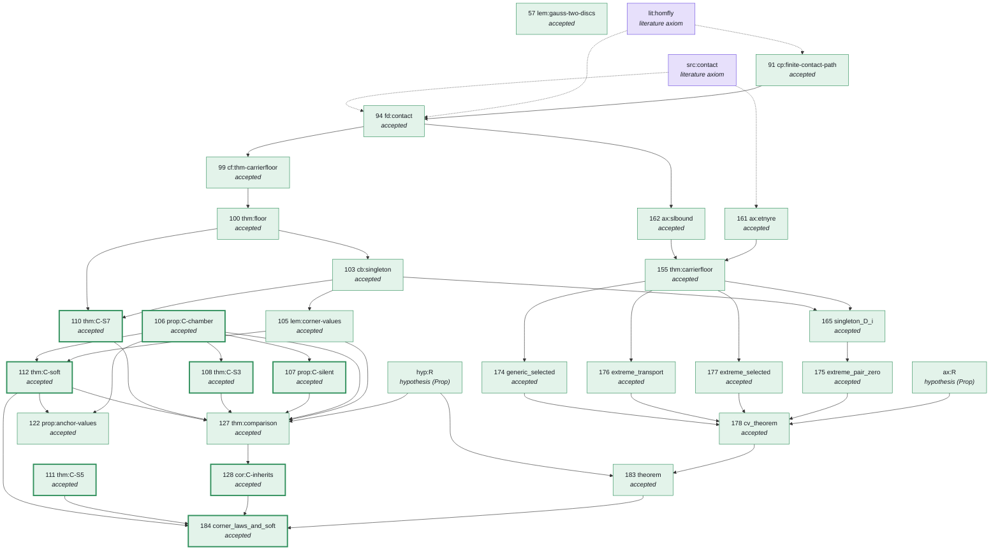

# corner-laws-lean

Machine-checked (Lean 4) formalization of **"Corner state sum: wall laws and soft theorem"** (source frame SM15,
frozen 2026-09-12). The single deliverable is one Lean theorem, `SM.corner_laws_and_soft`: the corner state sum `C`
satisfies every wall law of `cor:A-lawful` on the printed domains, together with the soft theorem, with Hypothesis R
*proved* rather than assumed.

The work was executed autonomously by a Claude Code session on Mark's pod, one source statement at a time, with
independent AI reviewers checking that each Lean statement says what the paper says. **It was completed on
2026-09-19 at 15:55 UTC.** This repository holds the delivered package (`CORNER_LAWS_FOCUSED_20260912/`, byte-identical
to the final tarball except for the two repo-only edits listed in section 4) plus the owner-side notes.

| State as of 2026-09-19 15:55 UTC (re-verified statically on 2026-09-20, section 5) | |
|---|---|
| Source claims proved and accepted | **132 / 132** |
| Checklist rows accepted (definitions, claims, interfaces, obligations) | **192 / 192** |
| Final targets accepted | **8 / 8** |
| Placeholders (`sorry`, `admit`, `native_decide`) in `work/lean` | **0** (712 files, 366,040 lines) |
| Axioms beyond Lean's three standard ones | **6 constants** for the **5** registered literature interfaces of the paper (section 1) |
| Stage check `tools/check_lean.py work/lean --all` | **PASS** (stage 1: 191 mapped, 49,207 audited; development: 192 / 49,212) |
| Reviews | 192 / 192 rows have an independent review record (3 lenses + 2 refuters, all verdicts faithful); all reviewers are AI sessions, no human has read them |

---

## 1. The theorem

`TARGETS.md` in the package fixes the final theorem as the conjunction of eight source results, each with a
checker-enforced Lean name (`work/lean/axiom-policy.json`). All eight are accepted:

| # | Source result | Lean name | Module |
|---|---|---|---|
| 106 | prop:C-chamber — `C` is constant on every chamber | `SM.prop_C_chamber` | `SM/CChamber.lean` |
| 107 | prop:C-silent — silent walls (exterior extension, pure cut) | `SM.prop_C_silent` | `SM/CSilent.lean` |
| 108 | thm:C-S3 — the flat law | `SM.thm_C_S3` | `SM/CS3.lean` |
| 110 | thm:C-S7 — the vertex–edge law (bigon and sliding) | `SM.thm_C_S7` | `SM/CS7.lean` |
| 111 | thm:C-S5 — the empty-cusp zero | `SM.thm_C_S5` | `SM/CS5.lean` |
| 112 | thm:C-soft — the soft theorem for `C` | `SM.thm_C_soft` | `SM/CSoft.lean` |
| 183 | Bridge:theorem — Hypothesis R for SM, proved from the CV R theorem | `Bridge.sm_R` | `Bridge/SmRRow.lean` |
| 184 | SM:corner_laws_and_soft — the assembly, with R discharged | `SM.corner_laws_and_soft` | `SM/CornerLawsAndSoft.lean` |

The final declaration (`work/lean/SM/CornerLawsAndSoft.lean`) instantiates the conditional assembly with the proved
inputs; no R parameter remains:

```lean
theorem corner_laws_and_soft : CornerLawsAndSoftData :=
  corner_laws_and_soft_of Bridge.sm_R thm_C_S7 thm_C_soft (cor_C_inherits Bridge.sm_R)
```

`CornerLawsAndSoftData` is a `Prop` structure with one field per clause of the target: chamber constancy, silence,
the flat law, the vertex–edge law, triple-wall invariance (`hyp_R`, proved), the full cusp law, the empty-cusp zero,
the soft theorem, and the reversal, cyclic and triangle normalizations.

**Axioms.** The kernel's `#print axioms SM.corner_laws_and_soft` lists nine constants: `propext`,
`Classical.choice`, `Quot.sound`, and six literature constants — `SM.lit_homfly`, `SM.lit_homfly_descent`, `SM.lp_lm`,
`SM.lp_lm_uniqueness`, `SM.ng_finite_word`, `SM.src_contact`. These are the five literature interfaces registered in
`blueprint/AXIOM_REGISTRY.md`, with lit:homfly's printed descent sentence ("its value depends only on the oriented link
presented by D") declared as a second constant on the author's decision of 2026-09-15
([`docs/DECISION_GAP2_2026-09-15.md`](docs/DECISION_GAP2_2026-09-15.md)); 21 accepted rows, the final theorem among them,
depend on that constant. Every accepted declaration was audited against this list by the checker; nothing else is
unproved. The per-row footprints are in `FINAL_REVIEW.md` §4.3.

---

## 2. How it was finished (2026-09-15 to 2026-09-19)

- **2026-09-15/16 — GAP-2 closed, two branches stopped.** The executor applied the GAP-2 decision (the descent
  axiom), declared `src:contact`, and accepted 16 rows in one day (124/132). The two remaining branches — row 110
  `thm:C-S7` (kernel-proved modulo five named propositions after four waves) and row 177 `R:extreme_selected` (two
  named leaves after three windows) — were stopped by the reassessment rule's audits, not by any mathematical
  obstacle: each had exceeded its bounded attempts and its own estimates, and the rule handed the decision to the
  author. Row 57 was still deferred. Everything open was written into `OPEN_ITEMS_20260916.md` (106 items, with
  the fifteen decisions reserved for the author in its §G) and the state was handed over at 02:33 UTC on 09-16.
- **2026-09-19 05:33 UTC — the author's response.** [`handover/AUTHOR_RESPONSE_20260919.md`](handover/AUTHOR_RESPONSE_20260919.md),
  recorded verbatim on the pod as `D-AUTH-20260919`: continue to completion; cost, time and attempt counts are never
  grounds for stopping a branch; rows 110 and 177 re-opened with no bound; row 57 un-deferred; every housekeeping item
  answered.
- **Row 177 and the kink (closed 08:39 UTC, no hypothesis added).** The one genuinely mathematical question. At the
  RIII site the proof smooths the lifted crossing over the triangle crossing `x_ef` and expects a bigon; that fails if
  the crossing is a *kink* (the lifted curve leaves the crossing, takes one edge and crosses itself again — the
  monogon `e → e+1 → e+2 = f` cut by `g`). The local site data cannot exclude it, and it is a genuine 177
  configuration, so the intermediate proposition "not a kink" was false as stated. The row closed anyway: the
  obligation the row needs was proved in its HOMFLY-value form in both cases, the non-kink case through the
  constructed bigon deletion and the kink case through a flat subdivision of the one-component lift (`w3dk_*`
  in `RProof/ExtremeSelectedUnits.lean`). No event-level hypothesis, no narrowing of the theorem. Rows 178 and
  183 followed as one-liners.
- **Row 110 (closed 13:26 UTC).** Corner waves 4–6 closed the five propositions (`SM/CS7Units.lean`, 27,000 lines,
  from the 27.5k-line assembly `work/drafts/corner/W6_Assembled.lean`); rows 127, 128 and the final theorem 184
  followed the same hour.
- **Row 57 `lem:gauss-two-discs` (closed 15:14 UTC).** The polygonal Jordan–Schoenflies fact, 21k lines over six
  `SM/GaussTwoDiscs*.lean` modules, on standard axioms only. Four internal skeleton sub-lemmas were false as stated
  and were replaced by corrected, proved forms (two with kernel-checked counterexamples); the row statement did not
  change. It was the last pending row.
- **Closing cycle (15:16–15:55 UTC).** Ten comment-only documentation patches applied; the registry sub-entry
  applied and reverted (it changed the frozen registry's hash, which the stage check binds through row
  `ng:finite-word`); `check_lean.py --all` PASS at 15:36; `FINAL_REVIEW.md` regenerated; manifest refreshed;
  final tarball `RESULT_FINAL_20260919_1554Z.tgz`
  (sha256 `40c1be0b6f709aa80d2b79026d3c10764a21a9bb132009eac63bab0a06b4baae`,
  [`handover/RESULT_FINAL_NOTE_20260919.md`](handover/RESULT_FINAL_NOTE_20260919.md)).

### The chain that was still open on 2026-09-16, now closed

The same 31-node critical chain the 2026-09-15 README showed in orange and red, regenerated from the final
declaration map. Green = accepted, violet = literature axiom, thick border = one of the eight targets; an arrow means
"is needed by".



The same figure with swim-lane columns, as a static image: [`docs/proof-graph-critical.svg`](docs/proof-graph-critical.svg).

---

## 3. The whole graph

All 192 checklist rows in eleven swim lanes by chapter of the source, prerequisites on the left, wired by the 443
blueprint dependency edges. Every node carries its row id; all are accepted.


An interactive version with pan/zoom, lane filters and a per-row panel (source line, Lean name, prerequisites,
consumers) is [`docs/corner_laws_proof_graph.html`](docs/corner_laws_proof_graph.html); download it and open it in a
browser (GitHub does not render HTML). All three are generated from the package by
[`docs/graph/build_dag.py`](docs/graph/build_dag.py) and [`docs/graph/render_svg.py`](docs/graph/render_svg.py):

```sh
cd docs/graph && python3 build_dag.py dag_data.json && python3 render_svg.py dag_data.json ..
python3 - <<'EOF'
d=open('dag_data.json').read().replace('</','<\\/'); h=open('dag.tmpl.html').read().replace('/*__DATA__*/null',d)
open('../corner_laws_proof_graph.html','w').write(h)
EOF
```

When nothing is pending, `build_dag.py` keeps the last recorded critical chain (read from the previous
`dag_data.json`) so the critical view shows it closed.

---

## 4. Repository layout

```
CORNER_LAWS_FOCUSED_20260912/   the package as delivered on 2026-09-19 (two repo-only edits, listed below)
  START_HERE.md, CLAUDE.md …    the executor's instructions (START_HERE.md and STATE_OF_WORK.md still describe the
                                2026-09-12 start state; ignore their counts)
  TARGETS.md, PROOF_PLAN.md     the eight targets with the printed statements; the proof route
  FINAL_REVIEW.md               the completed fidelity review (1,657 lines): per-row status, axioms, honest gap list
  OPEN_ITEMS_20260916.md        the register of everything that was open at the 09-16 handover (all closed on 09-19)
  blueprint/                    frozen: the 172 selected source statements, AXIOM_REGISTRY.md, DEPENDENCIES.json, NODES.tsv
  reference/, provenance/       frozen: the source TeX extracts (frame SM15) and the pins that tie them to the manuscript
  SOURCES/                      the literature behind the five admitted interfaces (third-party PDFs: keep this repo private)
  tools/                        claims.py (worklist), progress.py (the status line), check_lean.py (build + kernel axiom audit)
  work/lean/                    the Lean library: 658 SM, 32 CV, 15 RProof, 5 Bridge modules + Supplemental/Audit.lean
  work/lean/lean-declarations.json   the declaration map: one entry per row with status, Lean name, module, review, hash
  work/lean/axiom-policy.json   the registered axioms and the fixed names of the targets
  work/reviews/                 one JSON review record per accepted row (+ reviewer inputs and source excerpts)
  work/drafts/                  provenance of every ported module: plans, frozen statements, prover units, assemblies, reports
  work/checks/                  checker receipts (dev-check-*.json, stage-*.json, logs) and the previous executor's candidate lane
  work/AUTHOR_NOTES.md          the decision log (7,154 lines, every decision with its id: D-*, FR-*, A-*, …)
  work/STATUS.md                dated checkpoints; work/RESUME_FOR_NEXT_AGENT.md: how the work was picked up
  work/delivery/                the packaged delivery (README, pins, receipts, refresh.sh)
handover/                       the 2026-09-14 handover note, the 09-14 and 09-16 session memory files, the author's
                                2026-09-19 response, the final result note
docs/                           this README's figures, the interactive graph, the GAP-2 decision record
tools_extra/static_audit.py     the one-minute audit (no Lean needed)
RESEARCH_LOG.md                 the owner-side log of audits and decisions
```

Ignored (see `.gitignore`): the Lean build cache `work/lean/.lake` (gigabytes, rebuilt by `lake build`), the two
large files the checker rewrites on every run (`declaration-audit.json`, `lean-check.log`), the compressed audit copy
in `work/delivery/receipts` (60 MB), session logs, and handover archives.

Deliberate changes to the package in this repository, relative to the final tarball (the same two as on 2026-09-15):

1. The package ships its own `.gitignore` with `work/` on the first line, which would keep the entire Lean library,
   the reviews and the drafts out of git. That line is removed; the other three lines stay.
2. The root `MANIFEST.sha256` line for `.gitignore` is refreshed with the package's own
   `work/port/refresh_manifest.py`, so `verify_bundle.py` passes.

Nothing else differs: every other file is byte-identical to the tarball (checked by hash on 2026-09-20; the eight
`__pycache__/*.pyc` files in the tarball are not copied), and every file named in the pod's final checker receipts
still matches its hash.

---

## 5. Building and checking

Pins: Lean `leanprover/lean4:v4.34.0-rc2`, Mathlib `85e3a25e006c35636f0e53b0e9296caca2685bc0` (`work/lean/lake-manifest.json`).
Machine: 8 cores and 32 GB RAM recommended, ~10 GB disk for the caches.

```sh
cd CORNER_LAWS_FOCUSED_20260912
bash setup.sh                 # installs elan + toolchain, clones deps, downloads prebuilt Mathlib, builds, verifies
```

The same steps, run separately:

```sh
cd CORNER_LAWS_FOCUSED_20260912/work/lean && lake build            # ~9 min on the pod with the Mathlib cache warm; longer cold
cd ../.. && python3 tools/check_lean.py work/lean                    # expected: passed true, mapped 192, audited 49212
python3 tools/check_lean.py work/lean --all                          # expected: PASS, "all_required_stages_passed": true
python3 verify_bundle.py                                             # expected: FOCUSED BUNDLE VERIFIED: 191 files
```

`check_lean.py` builds the mapped modules, then runs `Supplemental.auditProject` inside Lean: every declaration of the
project is checked against the registered axiom list (`sorryAx`, `native_decide` and unregistered axioms are rejected)
and every mapped row's statement is hashed together with its semantic dependencies. Its receipts are
`work/checks/stage-development.json` and `work/checks/stage-1.json`.

**A full rebuild has not been repeated outside Mark's pod.** What has been verified on the owner's side is static:
the shipped sources are byte-identical to the files named in the pod's final receipts (716 Lean files), the 191
review records match the hashes bound in the stage receipt, and every accepted row's statement hash matches the
shipped audit. The static audit needs only Python and takes about a minute:

```sh
python3 tools_extra/static_audit.py CORNER_LAWS_FOCUSED_20260912
```

Output on 2026-09-20 for this repository's copy:

```
lean files: 712 | lines: 366040
code-level sorry/admit/native_decide: 0
axiom declarations: ng_finite_word (work/lean/SM/FrontInterfaces.lean), lit_homfly (work/lean/SM/LinkInterfaces.lean),
                    lp_lm (work/lean/SM/LinkInterfaces.lean), lp_lm_uniqueness (work/lean/SM/LinkInterfaces.lean),
                    lit_homfly_descent (work/lean/SM/LitHomflyDescent.lean), src_contact (work/lean/SM/SrcContact.lean)
final receipt: passed=True mapped=192 audited=49212 | files hashed 716, mismatching 0, unhashed .lean 0
declaration map: {'accepted': 192}
accepted statement hashes vs shipped audit: 192/192 match
fixed-name declarations absent: 0:
verify_bundle.py: PASS
RESULT: PASS (0 warnings)
```

---

## 6. How the work was done

- **One row at a time.** `python3 tools/claims.py --next` named the next unit in document order. For each row the
  executor fixed the Lean statement first (one field per printed clause, with a docstring mapping the paper's notation),
  proved it (for large rows: a design panel, then parallel prover units on a frozen skeleton, then an assembler),
  ported the finished draft verbatim into `work/lean`, mapped the row, and ran the checker.
- **Independent review before acceptance.** Reviewers saw only the printed source, the Lean statement with every proof
  replaced by `sorry`, and the definition modules; three lenses (literal, definitions, strength) plus two adversarial
  refuters; acceptance needed three "faithful" verdicts and no refutation. The record, with the hashes of everything the
  reviewers read, is `work/reviews/<row>.json`. Fidelity risks were written to `AUTHOR_NOTES.md` *before* a row was
  stated. All reviewers were Claude sessions of the same model family as the implementer; this is disclosed in every record.
- **Rules that never bent** (package `CLAUDE.md`): no `sorry` in `work/lean`; never delete, rename or rewrite an
  accepted declaration; the frozen folders are never edited; a statement believed false gets a kernel-checked
  counterexample under `work/repairs/` and stays unaccepted; an incomplete stage is reported as incomplete.
- **False-as-stated findings** (rule 3): whenever a draft leaf or a library interface field turned out to be false
  as stated, the assembler replaced it with a proved corrected or weaker form and the row closed through that form;
  no row statement was ever changed, and the accepted library kept its literal fields (author's decision G-04).
  `FINAL_REVIEW.md` §5 item 4 lists every such case.
- **Reassessment rule** (`handover/handover_extras/reassessment_rule.md`): after two substantive attempts or 60 minutes
  without a newly accepted claim, the executor stopped expanding and wrote a bounded audit into `AUTHOR_NOTES.md`.
  Until 2026-09-19 a failed audit handed the branch to the author; the author's response of that day kept the audits
  but ruled that only a mathematical blocker may stop a branch.
- **Reporting.** `python3 tools/progress.py --once` prints the one-line status; checkpoints went to `work/STATUS.md`;
  every decision, audit and fidelity reading is in `work/AUTHOR_NOTES.md`.

---

## 7. Caveats

1. **No rebuild outside the pod.** The receipts and hashes above are the pod's; a fresh `bash setup.sh` +
   `check_lean.py --all` on another machine has not been run (section 5).
2. **`FINAL_REVIEW.md` is not bound by the receipts.** It was completed after the last checker run (15:52 UTC receipt,
   15:54/15:55 UTC text), so the receipts' `bundle_sha256` differs for that one file; `tools/progress.py` therefore
   prints "Stage 1: not established by a current checker receipt". Structural (a report cannot contain the hash of its
   own final text); a re-run of the checker on this copy would close it.
3. **The descent axiom.** GAP-2 was closed by the author's decision, not by a proof: `SM.lit_homfly_descent` asserts the
   printed descent sentence of lit:homfly for `SM.homfly`. A reader who does not accept that reading should treat the
   21 rows that depend on it, the final theorem among them, as "proved modulo Reidemeister's theorem for smooth
   isotopies plus isotopy extension" (`FINAL_REVIEW.md` §5 item 1). Its sub-entry could not be added to the frozen
   registry without breaking a source-hash rule; the disclosure lives in the policy label and the review.
4. **All reviews are AI reviews**; no human has read any of the 192 records (author's decision G-10: a human
   spot-check is not a completion requirement and is to be arranged separately).
5. **Literal library fields kept.** A few accepted library structures carry fields that are false or unrealisable as
   stated (`est_PortData.port/rot/alt`, `esc_MoveData.rii_after_smoothing`, `s7b_SlidingTransport.ret`,
   `G11_Config.trans`); the rows that need them close through proved weaker forms or a trans-free additive copy, and
   the literal fields are unused by any accepted proof. Listed in `FINAL_REVIEW.md` §5 item 4.
6. **Blueprint edges not used by the proofs:** 57 → 104 and 57 → 105 (both consumers were proved without row 57).
7. **Documentation only:** row 57's U8 unit carries a verbatim copy of U10's fan toolkit (73 declarations, not
   de-duplicated); 15 linter warnings; row 174's σ orientation note is recorded in `FINAL_REVIEW.md` §5 rather than in
   `AUTHOR_NOTES.md`.

---

## 8. History

| Date | Event |
|---|---|
| 2026-09-09 | First handoff package (frame SM12): scaffold and sources, no proofs. |
| 2026-09-10 | Focused package "corner laws" cut from the full handoff; infrastructure audit (`DELIVERY_AUDIT.md`, `VALIDATION.md`). |
| 2026-09-12 | Previous executor found `lem:shift`(iii) false off the generic locus (`ERRATUM_20260912.md`); source re-issued as frame SM15; package realigned. State: 20/132 claims, 40/192 rows. |
| 2026-09-13 13:40 UTC | Mark's pod executor starts from that state. |
| 2026-09-14 18:20 UTC | Reachable ceiling without a GAP-2 decision: 109/132 claims, 168/192 rows, 4/8 targets. |
| 2026-09-15 | GAP-2 decision: restate the descent clause additively (`docs/DECISION_GAP2_2026-09-15.md`). This repository created and seeded from the 09-14 handover. |
| 2026-09-15/16 | GAP-2 executed; 16 rows accepted (124/132, 5/8 targets); rows 110 and 177 stopped by audits; `OPEN_ITEMS_20260916.md`; handover tarball 02:33 UTC. |
| 2026-09-19 05:33 UTC | The author's response `D-AUTH-20260919`: continue, no cost stop, row 57 un-deferred. |
| 2026-09-19 08:39 UTC | Rows 177, 178, 183 accepted (6/8 targets); the kink question closed without a hypothesis. |
| 2026-09-19 13:26 UTC | Rows 110, 127, 128, 184 accepted (8/8 targets; 131/132). |
| 2026-09-19 15:14 UTC | Row 57 accepted: 132/132, 192/192. |
| 2026-09-19 15:36 UTC | `check_lean.py --all` PASS; 15:55 UTC final tarball `RESULT_FINAL_20260919_1554Z.tgz`. |
| 2026-09-20 | Final tarball verified on the owner's side (`RESEARCH_LOG.md`); this repository brought to the final state; tag `final-20260919-1554Z`. |

---

## 9. Next steps

1. **Independent rebuild.** Run `bash setup.sh` and `python3 tools/check_lean.py work/lean --all` on a fresh
   32 GB machine and commit the receipts; this is the only verification never done outside the pod.
2. **Fidelity against a statement, not the paper.** A Lean theorem's meaning is fixed by its statement, the
   definitions it unfolds to, and the axioms — never by the proofs. The shipped audit lists the final theorem's
   statement closure: 383 project declarations, all in the SM namespace (234 definitions, 26 inductive types, 96
   lemmas used inside definitions, 26 structures and instances, and the axiom `SM.lit_homfly`, of which `SM.homfly`
   is the chosen witness), on top of Mathlib. A *statement package* — those declarations with every proof stripped,
   the six axioms, the theorem's type, and the kernel's axiom list as certificate — is what a short letter that
   states the definitions and uses the theorem should be checked against. `work/port/strip_proofs.py` and the
   audit's `semantic_dependencies` are the existing tools.
3. **Human spot-check** of the AI reviews, starting with `FINAL_REVIEW.md` §4–§5 and, per row, the `reason` and
   `discrepancies` fields of `work/reviews/<row>.json`.
4. Add the static audit as a GitHub Action; add Mark as a collaborator when the owner says so.
